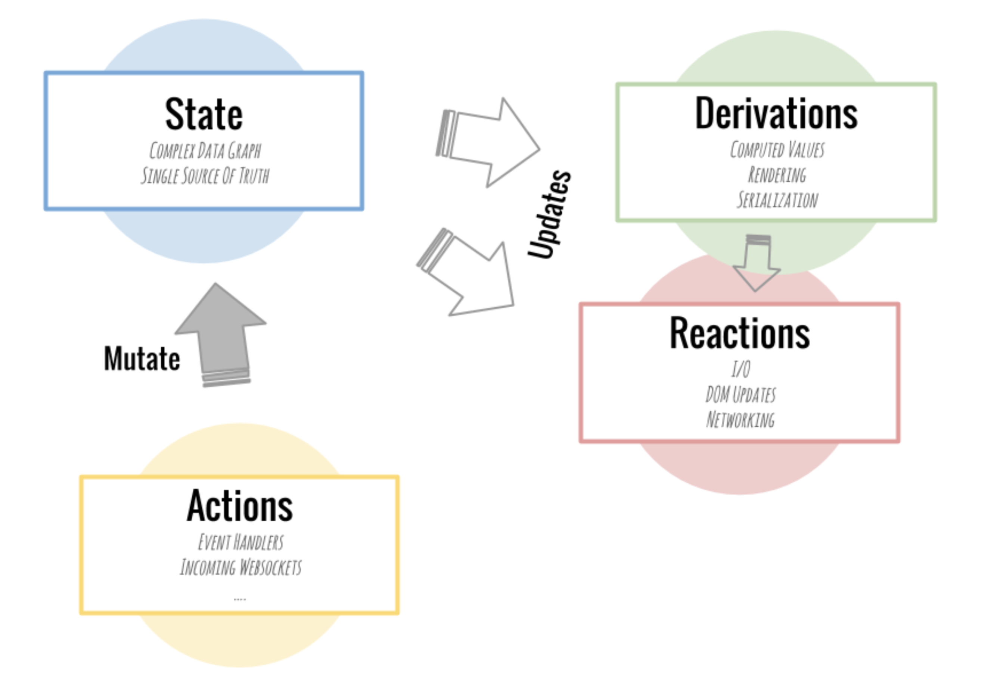

# 前言

当我们使用 React 开发 web 应用程序时，在 React 组件内，可以使用`this.setState()`和`this.state`处理或访问组件内状态，但是随着项目变大，状态变复杂，通常需要考虑组件间通信问题，主要包括以下两点：

1. 某一个状态需要在多个组件间共享（访问，更新）；
2. 某组件内交互需要触发其他组件的状态更新；

关于这些问题，React 组件开发实践推荐将公用组件状态提升：

> Often, several components need to reflect the same changing data. We recommend lifting the shared state up to their closest common ancestor

> 通常多组件需要处理同一状态，我们推荐将共享状态提升至他们的共同最近祖先组件内。更多详情查看

# MobX with React Introduction

Mobx 是一个简单的状态管理库，可以方便地在 react 中使用。
我们可能了解或使用过 redux，今天我介绍一个更简单和轻量的状态管理库，mobx，或许在以后的选技术栈的时候多一个选择。

Mobx 是一个透明函数响应式编程（Transparently Functional Reactive Programming，TFRP）的状态管理库，它使得状态管理简单可伸缩：

> Anything that can be derived from the application state, should be derived. Automatically.

> 任何起源于应用状态的数据应该自动获取。

和 redux 很像，它的状态流长这样：

## MobX principals

> Actions -> State -> Derivations + Reactions

- Actions - 定义改变状态的动作函数，包括如何变更状态
- State - 集中管理模块状态(state)和动作(action)(与 Redux 的 store 类似)
- Derivations - 计算值总是可以使用纯函数从当前可观察状态中获取
- Reactions - 状态变更时需要自动发生的副作用，比如更新 UI



## Core Concepts

(需要介绍 decorator)

### 1. Observable & Observer

> @observable - turn a property into an observable, observers will be notified and react to changes in those properties. The properties types can be objects, arrays or references.

> @observer (mobx-react) - make react component reactive to the state change. Basically, it calls the component’s render function when the state changes.

**需要补充 observer 代码**

<!-- ES6 version -->

```js
import { observable } from "mobx";

class Todo {
  @observable title = "";
  @observable finished = false;
}
```

<!-- ES5 version

```js
import { decorate, observable } from "mobx";

class Todo {
  id = Math.random();
  title = "";
  finished = false;
}
decorate(Todo, {
  title: observable,
  finished: observable
});
``` -->

### 2. Computed

> @computed - values that will be derived automatically when relevant data is modified.

```js
class TodoList {
  @observable todos = [];
  @computed get unfinishedTodoCount() {
    return this.todos.filter(todo => !todo.finished).length;
  }
}
```

当添加了一个新的 todo 或者某个 todo 的 finished 属性发生变化时，MobX 会确保 unfinishedTodoCount 自动更新。

### 3. actions

> @action - a method that changes the state.

```js
 @action public updateTitle = (title: string) => {
    this.title = title;
  };
```

### 4. Provider and @inject

> Provider and @inject - inject the store to the component (like connect in Redux).

## mobx-react

如果你用 React 的话，可以把你的(无状态函数)组件变成响应式组件，方法是在组件上添加 observer 函数/ 装饰器. observer 由 mobx-react 包提供的。

```js
// 函数型组件写法
const TodoView = observer(({ todo }) => (
  <li>
    <input
      type="checkbox"
      checked={todo.finished}
      onClick={() => (todo.finished = !todo.finished)}
    />
    {todo.title}
  </li>
));
```

Mobx 会对文件当中的@computed 修饰的方法、render()方法、when 方法的第一个入参函数、reaction 方法的第一个入参函数、autorun 方法的第一个入参函数这些地方收集，MobX 会在页面加载执行前扫描所有的文件，收集这些地方的绑定。

### 对 observable 作出响应

- 自定义 reactions
  使用 autorun、reaction 和 when 函数即可简单的创建自定义 reactions，以满足你的具体场景。可以讲一下 reaction, autorun, when

经验法则:

> MobX 会对在`追踪函数`执行`过程`中`读取`现存的可观察属性做出反应。

- 理解 Mobx 对什么作出反应
  - “读取” 是对象属性的间接引用 (例如 `user['name']`)
  - “追踪函数” 是 `computed` 表达式、`observer` 组件的 `render()` 方法和 `when`、`reaction` 和 `autorun` 的第一个入参函数。
  - “过程” 意味着只追踪那些在函数执行时被读取的 `observable`

### 使用 MobX 将一个应用变成响应式的可归纳为以下三个步骤:

1. 定义状态并使其可观察

可以用任何你喜欢的数据结构来存储状态，如对象、数组、类。 循环数据结构、引用，都没有关系。 只要确保所有会随时间流逝而改变的属性打上 mobx 的标记使它们变得可观察即可。

```js
import { observable } from "mobx";

var appState = observable({
  timer: 0
});
```

2. 创建视图以响应状态的变化

我们的 appState 还没有观察到任何的东西。 你可以创建视图，当 appState 中相关数据发生改变时视图会自动更新。 MobX 会以一种最小限度的方式来更新视图。 事实上这一点可以节省了你大量的样板文件，并且它有着令人匪夷所思的高效。

通常来说，任何函数都可以成为可以观察自身数据的响应式视图，MobX 可以在任何符合 ES5 的 JavaScript 环境中应用。 但是在这所用的示例是 ES6 版本的 React 组件视图。

```js
import { observer } from "mobx-react";

@observer
class TimerView extends React.Component {
  render() {
    return (
      <button onClick={this.onReset.bind(this)}>
        Seconds passed: {this.props.appState.timer}
      </button>
    );
  }

  onReset() {
    this.props.appState.resetTimer();
  }
}

ReactDOM.render(<TimerView appState={appState} />, document.body);
Copy;
```

3. 更改状态

第三件要做的事就是更改状态。 也就是你的应用究竟要做什么。 不像一些其它框架，MobX 不会命令你如何如何去做。 这是最佳实践，但关键要记住一点: MobX 帮助你以一种简单直观的方式来完成工作。

下面的代码每秒都会修改你的数据，而当需要的时候 UI 会自动更新。 无论是在改变状态的控制器函数中，还是在应该更新的视图中，都没有明确的关系定义。 使用 observable 来装饰你的状态和视图，这足以让 MobX 检测所有关系了。

```js
appState.resetTimer = action(function reset() {
  appState.timer = 0;
});

setInterval(
  action(function tick() {
    appState.timer += 1;
  }),
  1000
);
```

只有在严格模式(默认是不启用)下使用 MobX 时才需要 action 包装。 建议使用 action，因为它将帮助你更好地组织应用，并表达出一个函数修改状态的意图。 同时,它还自动应用事务以获得最佳性能。

可以通过 JSFiddle 或者克隆 MobX 样板工程 来随意试用这个示例。

## Some Tips

- enforceAction

  “强制动作” 强制所有状态变更都必须通过动作来完成。在大型、长期的项目中，这是十分有用的最佳实践:

  > Also known as "strict mode". In strict mode, it is not allowed to change any state outside of an action. Accepted values:
  >
  > - "never" (default): State can be modified from anywhere
  > - "observed": All state that is observed somewhere needs to be changed through actions. This is the recommended strictness mode in non-trivial applications.
  > - "always": State always needs be updated (which in practice also includes creation) in actions.

  How to config:

  ```js
  import { configure } from "mobx";
  configure({
    enforceActions: "always"
  });
  ```

- use runInAction in asyncFunctions

  - runInAction(name?, thunk)
    runInAction 是个简单的工具函数，它接收代码块并在(异步的)动作中执行。这对于即时创建和执行动作非常有用，例如在异步过程中。runInAction(f) 是 action(f)() 的语法糖。

### 改变 observable 的方法

#### 1. action

#### 2. async actions

```js
 @action
  public addListItem = async (item: string) => {
    try {
      const itemDetail = await this.fetchItemDetail(item);
      // await 之后，再次修改状态需要动作:
      runInAction(() => this.list.push(itemDetail));
    } catch (error) {
      console.log("error", error);
    }
  };
```

#### 3. flows

更好的方式是使用 flow 的内置概念。它们使用生成器。一开始可能看起来很不适应，但它的工作原理与 async / await 是一样的。只是使用 function \* 来代替 async，使用 yield 代替 await 。 使用 flow 的优点是它在语法上基本与 async / await 是相同的 (只是关键字不同)，并且不需要手动用 @action 来包装异步代码，这样代码更简洁。

flow 只能作为函数使用，不能作为装饰器使用。 flow 可以很好的与 MobX 开发者工具集成，所以很容易追踪 async 函数的过程。

## [Mobx 与 Redux 的对比](https://blog.csdn.net/sinat_17775997/article/details/83023458)

Redux 和 MobX 的异同

- 相同点：状态管理的能力
  1. 它们都有统一维护管理应用状态的能力
  2. 某一状态只有一个可信数据来源(store, 指状态容器)
  3. 支持将 store 与 React 组件连接，如 react-redux, mobx-react。

* 关注点的不同

  1. Redux: 遵循 Flux 模式的实现，关注点在于：

     - Action：描述动作相关信息，包括(type 和 payload)
     - Reducer：定义如何响应不同动作
     - Store（监听 action 的分发，订阅 store 的变更，支持中间件处理异步流程等等）

     **插入一个图**

  2. Mobx 是一个透明函数响应式编程的状态管理库，关注点在于：
     - Action：定义改变状态的动作函数
     - Store：集中管理模块状态(state)和动作(action)
     - Derivation：主要包括用户界面和衍生数据（reactions and computed values）

* 数据可变性的不同
  - Redux 强调的是对象的不可变性，不能直接操作状态对象，而是在原来状态对象的基础上返回一个新的状态对象
  - MobX 可以直接使用新值更新状态对象
* 设计思想的不同
  - Redux 更多的是遵循函数式编程思想
  - Mobx 更多偏向于面向对象编程和响应式编程（包装成可观察对象，一旦状态对象变更，就能自动获得更新）
    <!-- * 对 Store 管理的不同？ -->
    Redux 提倡编写函数式代码，如 reducer 就是一个纯函数（pure function），如下：

```js
(state, action) => {
  return Object.assign({}, state, {
    ...
  })
}
```

纯函数接受输入，然后输出结果，除此之外不会有任何影响，也包括不会影响接收的参数；对于相同的输入总是输出相同的结果。

Mobx 设计更多偏向于面向对象编程（OOP）和响应式编程（Reactive Programming），通常将状态包装成可观察对象，于是我们就可以使用可观察对象的所有能力，一旦状态对象变更，就能自动获得更新。

### MobX 的优点

- 易操作性
  MobX 使用原生 javascript 。由于它的侵入性不强，它可以和绝大部分 javascript 库共同使用，而不需要特定的 MobX 风格库。

- 所以你可以继续使用你的路由，数据获取和工具库，比如 react-router、 director、 superagent、 lodash，等等。

- 出于同样的原因，你可以在服务器端和客户端使用它，也可以在 react-native 这样的同构应用中使用。

- 学习成本少
  Mobx 基础知识很简单，学习了半小时官方文档和示例代码就搭建了新项目实例；而 Redux 确较繁琐，流程较多，需要配置，创建 store，编写 reducer，action，如果涉及异步任务，还需要引入 redux-thunk 或 redux-saga 编写额外代码，Mobx 流程相比就简单很多，并且不需要额外异步处理库；
- 面向对象编程
  Mobx 支持面向对象编程，我们可以使用@observable and @observer，以面向对象编程方式使得 JavaScript 对象具有响应式能力；而 Redux 最推荐遵循函数式编程，当然 Mobx 也支持函数式编程；
- 模版代码少
  相对于 Redux 的各种模版代码，如，actionCreater，reducer，saga／thunk 等，Mobx 则不需要编写这类模板代码；

> 结论就是: 相比其它状态管理解决方案，当使用 MobX 时通常只需学习更少的新概念。

---

### decorator

```js
import { observable, action } from "mobx";
// @decorator语法应用这些装饰器
class TaskStore {
  @observable.shallow tasks = [];
  @action addTask(task) {
    /* ... */
  }
}
```

```js
import { observable, action } from "mobx";
// 或者用observable传入装饰器
const taskStore = observable(
  {
    tasks: [],
    addTask(task) {
      /* ... */
    }
  },
  {
    tasks: observable.shallow,
    addTask: action
  }
);
```

```js
// 用法: decorate(object, decorators)
// 这是将可观察性装饰器)应用于普通对象或类实例的简便方法。第二个参数是一个属性设置为某些装饰器的对象。
// 当无法使用 @decorator 语法或需要对可观察性进行更细粒度的控制时使用这个方法。
class TodoList {
  todos = {};
  get unfinishedTodoCount() {
    return values(this.todos).filter(todo => !todo.finished).length;
  }
  addTodo() {
    const t = new Todo();
    t.title = "Test_" + Math.random();
    set(this.todos, t.id, t);
  }
}

decorate(TodoList, {
  todos: observable,
  unfinishedTodoCount: computed,
  addTodo: action.bound
});
```

### mobx 最大的优化空间是尽量不要粗用 observer，因为双向绑定很耗性能，在需要的字段上 observer，而不是直接 observer 大数组对象

### 浏览器支持

- MobX >=5
  版本运行在任何支持 ES6 proxy 的浏览器。如果运行在像 IE11、Node.js 6 以下版本或依靠与较旧的 JavaScripCore 的安卓端的 React Native (点击查看如何升级])。
- MobX 4
  可以运行在任何支持 ES5 的浏览器上，而且也将进行持续地维护。MobX 4 和 5 的 API 是相同的，并且语义上也能达到相同的效果，只是 MobX 4 存在一些 局限性。

### MobX 4 vs MobX 5

MobX 4 和 MobX 5 的不同之处在于后者使用了 ES6 的 proxy 来追踪属性。因此，MobX 5 只能运行在支持 proxy 的浏览器上，而 MobX 4 可以运行在任何支持 ES5 的环境中。

MobX 4 的重要局限性:

- Observable 数组并非真正的数组，所以它们无法通过 Array.isArray() 的检查。最常见的处理方法是在传递给第三方库之前，你经常需要先对其进行 .slice() 操作，从而得到一个浅拷贝的真正数组。
- 向一个已存在的 observable 对象中添加属性不会被自动捕获。要么使用 observable 映射来替代，要么使用工具函数 中方法来对想要动态添加属性的对象进行读/写/迭代。

MobX injecting issues in TypeScript:

[Ref1](https://github.com/mobxjs/mobx-react/issues/256)

```js
export type MainStoreProps = {mainStore: MainStore};
export const mainStoreDefaultProps = {mainStore: (null as unknown) as MainStore};

interface Props extends MainStoreProps{}

@inject(MainStoreName)
@observer
export class SomeComp extends Component<Props> {
  static defaultProps = mainStoreDefaultProps;
}
```

[Ref2](https://mobx-react.js.org/recipes-inject)

```js
const NameDisplayer = ({ name }) => <h1>{name}</h1>;

const UserNameDisplayer = inject(stores => ({
  name: stores.userStore.name
}))(NameDisplayer);

const App = () => <UserNameDisplayer name="Is this name used? Who knows." />;
```

### P.S.响应式编程与函数式编程

- 响应式编程

响应式编程基于观察者模式，即发布-订阅模式。

例如，在命令式编程环境中， a:=b+c 表示将表达式的结果赋给 a，而之后改变 b 或 c 的值不会影响 a。但在响应式编程中，a 的值会随着 b 或 c 的更新而更新。
在响应式编程当中，a:=b+c 声明的是一种绑定关系。（a 与 b、c 绑定起来了，所以 b、c 的变化会影响 a，这也就是所谓【变化传播】）

- 函数式编程

  - 不产生副作用的函数称为纯函数。
  - 函数是一等公民=>高阶函数。
  - 函数式编程抽取了很多常用操作，作为高阶函数，比如 map，filter，reduce。
    有了这些函数，你的代码将被大大简化，也意味着你可以进行更加快速的开发，同时这些函数也帮助别人理解你的代码。

Ref:
[MobX 绑定过程和其中的一些坑的总结](https://blog.souche.com/mobxbang-ding-guo-cheng/)
