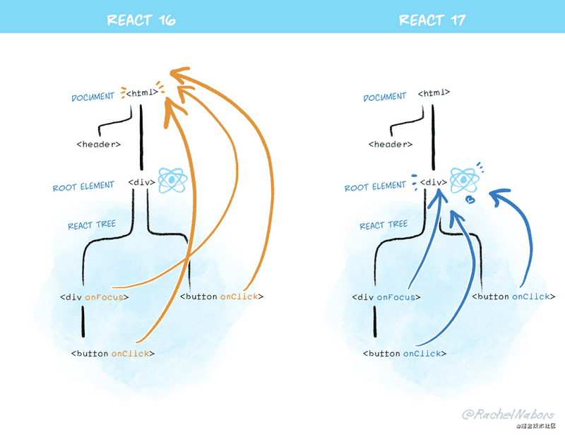

# 无新特性的 React17

> React 17 版本很特别，因为它并没有任何面向开发者的新功能，而是专注在了如何更轻松地升级 React 本身。
> React 17 的特别之处还在于，它发挥了「跳板」的作用。

## 零、新的 JSX 转换

React 17 支持新的 JSX 转换。我们还将对它支持到 React 16.14.0，React 15.7.0 和 0.14.10。需要注意的是，这是完全选择启用的，您也不必使用它。之前的 JSX 转换的方式将继续存在，并且没有计划停止对其支持。

> Changelog: 为全新的 JSX 转换器添加 react/jsx-runtime 和 react/jsx-dev-runtime。（@lunaruan 提交于 #18299）

## 一、渐进式升级

在过去的七年中，React 的升级一直很极端。你要么停留在旧的版本，要么将整个应用升级到新版本，不能选择中间态。

> 取舍：整个项目全量升级版本？忍痛继续使用过时的版本？

## 二、渐进升级示例

- facebook 准备了一个示例仓库，以演示如何在必要时懒加载旧版本的 React. 该示例用到了 Create React App, 但用其他工具应该也同样适用。

- facebook 已将其他变更推迟到了 React 17 之后。此版本的目标是实现渐进升级。如果升级到 React 17 太过困难，那将违背它发布的初衷。

## 三、事件委托的变更

在 React 组件中，通常在编写事件处理器会采用内联写法：

```js
<button onClick={handleClick}>
```

与其等价的原生 DOM 代码是这样的：

```js
myButton.addEventListener("click", handleClick);
```

但是，对于大多数事件来说，React 其实并不会在你声明它们的时候就将它们 attach 到对应 DOM 节点上。

相反地，React 会直接在 `document` 节点上为每种事件类型 attach 一个处理器. 我们把这叫做**事件委托**。这种方法在大型应用树上有性能优势。

自发布以来，React 的事件委托一直都是自动进行的。 当 DOM 事件被触发时，React 会找出要调用的组件，然后 React 事件会在你的组件中「冒泡」。 在这背后，原生的事件已经冒到了 `document` 级别 —— 也就是 React 安装其事件处理器的地方。

**但是，这对渐进升级来说是个问题。**

如果页面上有多个 React 版本，它们都将在顶部`document`注册事件处理器。这会破坏 `e.stopPropagation()`: 即便嵌套树停止了事件冒泡，外部的树仍会接收到该事件，这就使嵌套不同版本的 React 难以实现。

这就是我们要改变 React attach 事件到 DOM 的底层实现方式的原因。

**在 React 17 中，React 将不再在后台的文档级别附加事件处理程序。取而代之的是，它将它们附加到渲染您的 React 树的根 DOM 容器：**

```js
const rootNode = document.getElementById("root");
ReactDOM.render(<App />, rootNode);
```

在 React 16 和更早的版本中，React 将对大多数事件执行 document.addEventListener（）。React 17 将在后调用 rootNode.addEventListener（）。



<!-- 由于此变更，现在由某个版本的 React 管理的树，在嵌入另一个版本的 React 管理的树时更加安全了。但如果要实现此能力，两个 React 版本都必须为 17 或更高版本，这也是升级到 React 17 如此重要的原因。从某种意义上说，React 17 是一个「跳板」版本，它使得下一个渐进式升级切实可行。 -->

## 四、无事件池

React 17 移除了「事件池」优化。它不但不能提高现代浏览器的性能，甚至会连老练的 React 用户都会感到困惑：

```js
function handleChange(e) {
  setData((data) => ({
    ...data,
    // 在 React 16 及以前版本中会引发 crash
    text: e.target.value,
  }));
}
```

这是因为 React 在旧浏览器中为了提高性能而复用了不同事件之间的事件对象，并将所有事件字段设置为 `null`。在 React 16 及更早版本中，你必须调用 `e.persist()` 才能正确使用该事件，或者你也可以提前读取你需要的属性。

**在 React 17 中，此代码会如你期望地运行。旧的事件池优化已被完全删除，你可以在任何时候读取事件字段。**

这是一种行为变更，因此我们将其标记为 breaking。但实际上，在 Facebook 上我们还没有发现它造成过什么影响。（或许它还修复了一些错误呢！）请注意， e.persist() 在 React 事件对象上仍然可用，但是现在它什么也没做。

## 五、Effect 清理时机

我们正在使 useEffect 清理函数的时间更统一。

```js
useEffect(() => {
  // 这是 effect 本身
  return () => {
    // 这是它的清理函数
};});
}
```

大多数 effect 都不必延缓屏幕的更新，因此 React 都会在屏幕更新后再**异步运行**它们。（在极少数情况下，你需要一个 effect 来阻止重绘，比如说测量和定位工具提示的时候，请使用 `useLayoutEffect`）

但是在 React 16 中，如果有 effect 清理函数，它会同步运行。我们发现，就像 componentWillUnmount 在类中是同步运行的一样，在大型应用中这种方式并不理想，因为它会减慢大屏幕变换的速度（例如切换标签的时候）。

**在 React 17 中， effect 清理函数也是异步运行的 - 例如，如果要卸载组件，清理函数将在屏幕更新后运行。**

这反映了 effect 本身是如何更紧密运行的。在极少数情况下，你可能希望依赖同步执行，这时你可以改用 useLayoutEffect.

另外，React 17 会根据 effect 在树中的位置，以相同的顺序执行清理函数。以前，这个顺序会有所不同。

## 六、与浏览器对齐

我们对事件系统进行了一些小改动：

- `onScroll` 事件不再冒泡以防止常见的困惑。
- `React `onFocus`和`onBlur`事件已转换为引擎盖下的原生`focusin`和`focusout` 事件，这与 React 的现有实现更为接近，有时还能提供额外的信息。
- 捕获阶段事件（例如 `onClickCapture` ）现在使用真实的浏览器捕获阶段监听器。
  这些变更使 React 更加接近浏览器行为，互操作性也有所提升。

## 其他 breaking changes

- 返回 undefined 的兼容性错误
- 原生组件堆栈
- 移除私有导出

ref:

- [React 17 RC 版发布：无新特性，却有新期待！](https://zhuanlan.zhihu.com/p/183787177)
- [尝试 React 17 RC / Demo of Gradual React Upgrades](https://mp.weixin.qq.com/s/H8il6WwBGCSRrlqD8__gsg)
- [React 17 正式发布！更新一览](https://mp.weixin.qq.com/s/Wa-O1Q858e24oHFWKxJcUw)
