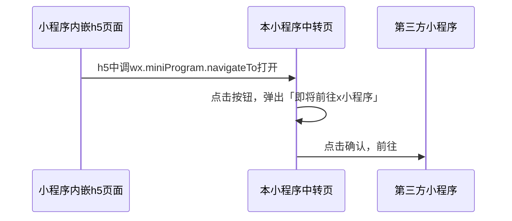

# 小程序内嵌 H5 页面跳转第三方小程序方案

> 使用 webview 可以在小程序中内嵌小程序。但是小程序内嵌的 h5 页面不能直接点击打开第三方小程序，需要做一个本小程序的中转页辅助跳转。

## 场景：webview 内嵌小程序

### 小程序原生代码

```html
<web-view
  src="{{src}}"
  bindload="onWVLoad"
  binderror="onWVError"
  bindmessage="handleMessage"
></web-view>
```

```ts
Page({
  data: {
    src: '',
    shareObj: {
      path: `/pages/x/index`,
      title: 'title',
    },
  },
  onLoad(options) {
    this.setData({
      src: decode(url) || `https://defaultUrl`,
    });
  },
  handleMessage(e: any) {
    // 监听h5传来的postMessage并进行记录。注意：这不是个实时动作。参考下方reference
    const index = e.detail.data.length - 1;
    const data = e.detail.data[index];
    if (data.query.sharetype === 'miniprogram') {
      this.setData({
        shareObj: {
          imageUrl: data.imgUrl,
          path: `/pages/x/index?url=${encode(data.linkUrl)}`,
          title: data.title,
        },
      });
    }
  },
  onShareAppMessage() {
    // 点击小程序“分享”时触发
    return this.data.shareObj;
  },
});
```

### h5 代码

```ts
// 把h5的分享信息post给小程序
wx.miniProgram.postMessage({
  data: {
    linkUrl: link,
    title: shareConfig.title,
    query: {
      sharetype: 'miniprogram',
    },
  },
});
```

### reference

- [微信官方文档-webView](https://developers.weixin.qq.com/miniprogram/dev/component/web-view.html)
  > wx.miniProgram.postMessage：向小程序发送消息，会在特定时机（小程序后退、组件销毁、分享）触发组件的 message 事件

## 方案：通过跳转到本小程序中转页进行辅助跳转

### 非内嵌小程序的 h5 页面跳第三方小程序方式

> `wx-open-launch-app` [微信官方文档](https://developers.weixin.qq.com/doc/offiaccount/OA_Web_Apps/Wechat_Open_Tag.html)

```html
<wx-open-launch-weapp
  id="launch-btn"
  username="gh_xxxxxxxx"
  path="pages/home/index?user=123&action=abc"
>
  <script type="text/wxtag-template">
    <style>.btn { padding: 12px }</style>
    <button class="btn">打开小程序</button>
  </script>
</wx-open-launch-weapp>
<script>
  var btn = document.getElementById('launch-btn');
  btn.addEventListener('launch', function (e) {
    console.log('success');
  });
  btn.addEventListener('error', function (e) {
    console.log('fail', e.detail);
  });
</script>
```

### 内嵌小程序的 h5 页面跳第三方小程序方式

#### 流程



h5 页面代码

```ts
//  跳转到本小程序中转页
wx.miniProgram.navigateTo({
  url: '/pages/x/index',
});
```

本小程序中转页代码

```ts
// 跳转到第三方页面
// 【注意】这个动作需要在bindtap中使用，比如按钮的点击回调函数
wx.navigateToMiniProgram({
  path: '/x/x/index?xxx=xxx',
  appId: 'wxxxxxxxxxx',
});
```

#### reference

- [微信官方文档-miniProgram.navigateTo](https://developers.weixin.qq.com/miniprogram/dev/devtools/auto/miniprogram.html#miniProgram-navigateTo)
- [微信官方文档-wx.navigateToMiniProgram](https://developers.weixin.qq.com/miniprogram/dev/api/navigate/wx.navigateToMiniProgram.html)